Title: 3D printing Workshop 

# Workshop Breakdown
## Introductions!
## Opening Presentation andRemarks (20 - 30 Minutes)
    * Introduction of 3D printing generally, different methods, processes and the printers used for the workshop
    * Overview of 3D modeling software
        - Overview of what 3D modeling software is
## Introduction to Autodesk Fusion (40 minutes - 1 hour)
    * Basic 3D modeling
        - A handout will be provide that walks participants through some of features/tools of 123D Design
        - At the end of this section of the workshop the participants will have create 3-4 'base' objects
    * Sandbox/ Introduction to Making your own 3D object on Fusion (1 hour)
        - Using the “base” models created earlier in the workshop participants will create their own models
        - Participants can create their own model if they already have something in mind.
## 3D printing time / More Sandbox (40 minutes – 2 hour)
    * Printing your own 3D object
        - Participants not ready to print are encouraged to continue working on their object
            - If you don’t finish their object in time you can come back to Studio 307 to model and print later!
    * Printing using the Makerbot
        - Using the Makerbot Desktop software participants will set-up and start a 3D print
		
# Introduction
The layout of Autodesk Fusion is comprised of three major parts: The workspace, the toolbar, and the viewing options.
## The Workspace

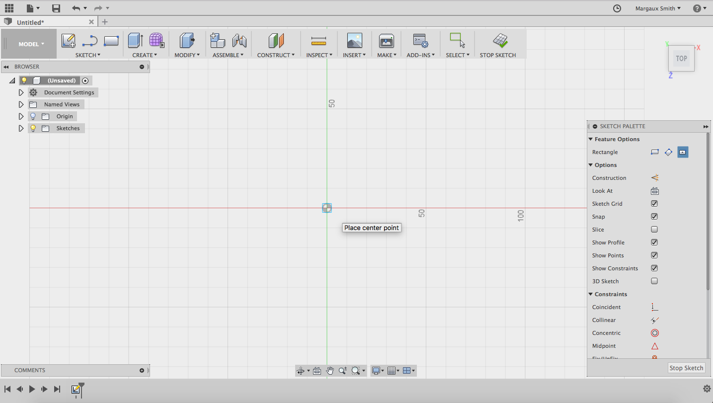

The workspace is where sketches and objects can be created and manipulated. It is represented by a grid, which will scale in size in relation to your project.
## The Toolbar

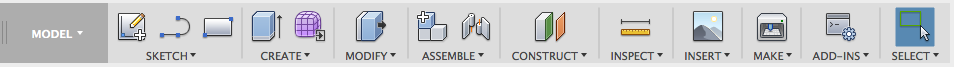

The toolbar is at the top of the window and contains various features/tools that will allow you to create 3D objects. This session you will be introduced to several, but not all, of these features.
## Viewing Options

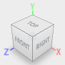

The viewing options can be found on the right hand side of the window. These will allow you to move the camera and change the property of the object in order to make modeling easier.

**TIP: Right clicking while over the workspace will allow you to “orbit” objects**
[comment]: Is this still valid? Review viewing hotkeys on the mouse

# Object One – DICE
The first object we will be creating is a dice. The goal of this section is to introduce you to several features of the program (such as the extrude, cut, and fillet) as well as challenging you to think three dimensionally.
## Creating a Base Solid
The first thing we need to do is to create a base solid, a cube, for our dice:

Select the **SKETCH** option in the toolbar and click on the **RECTANGLE** option. Then click on the grid in the workspace.

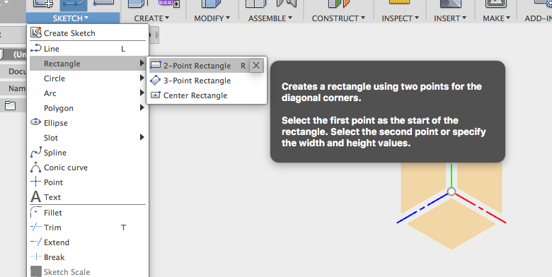

This will cause the grid to expand. To begin sketching click on the **ZERO POINT** (marked by a circle) which will now act as your base point for this object.

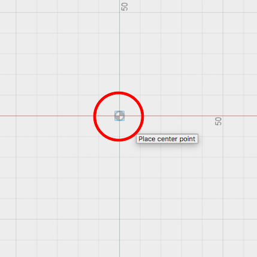

Move your mouse out a bit and the outlines of a rectangle will be sketched.

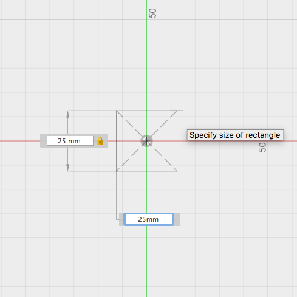

Enter a value of 25mm for both the length and width (using tab to move between the value boxes) and press enter. Your newly created square will change colours indicating you have **CLOSED** the sketch.

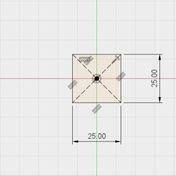
Next, go back to the toolbar and select the **CREATE** option and click on the **EXTRUDE** tool.

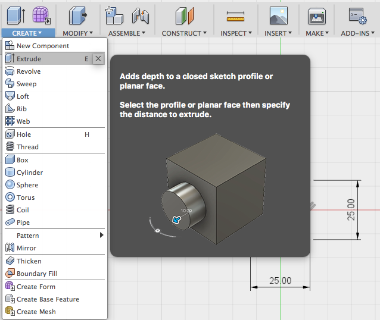

Click on your square, input a value of 25mm, and then press enter. You should end up with cube that looks like this:

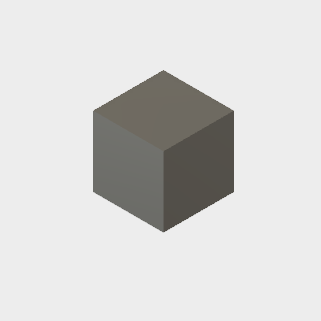

## Modifying the Base Solid
With our base solid now in place we cam start to make it more "dice" like in appearance.

Select the **MODIFY** option and click on the **FILLET** tool

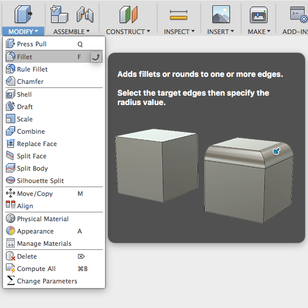

Begin to select the **EDGES** of the cube. They will change in colour once they have been selected.

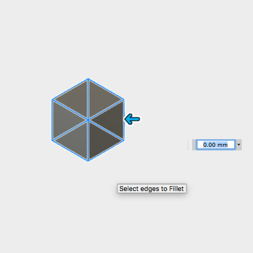

Once all the edges have been selected input a value of 2mm for the fillet radius and press enter.

**TIP: The edges can be fillet individually if you wish.**

The resulting cube should look like this:

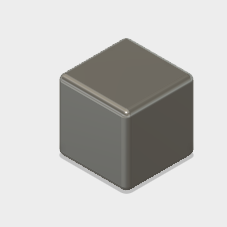

## Making Holes
The final step in making the dice is to assign values to each face.

Selected the **SKETCH** option in the toolbar and click on the **CIRCLE** tool.

To begin your sketch, click one of the faces the dice. This will cause the grid in the workspace to move over top of it.

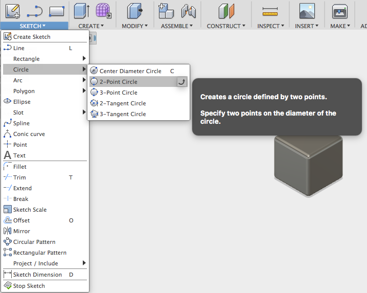

Move your mouse to the center of the face and click. Move your mouse slightly and the outline of a circle will be project. Input a value of 6mm for the diameter and press enter.

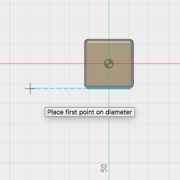

**TIP: Rotating the camera so it is directly pointed at the face will make this process easier.**

Select the **CREATE** option from the toolbar and click on the **EXTRUDE** tool.

From the dropdown menu that appears select the **SUBTRACT** option.

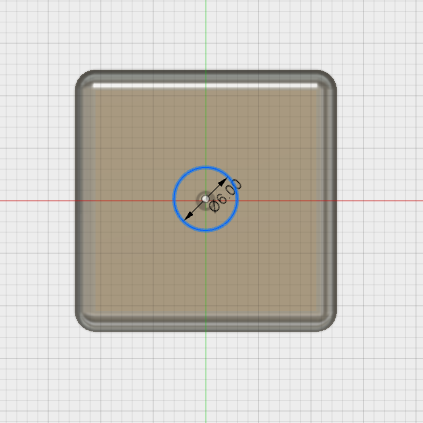

Then select the circle you just sketched, input a value of -3mm, and press enter. This will result in a cube that looks like this:

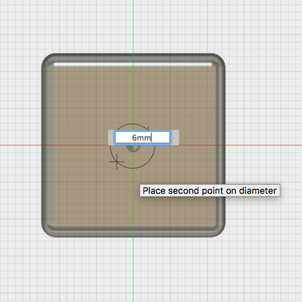

## Finishing Up
Using the below template assign, values to each of the dice's faces.

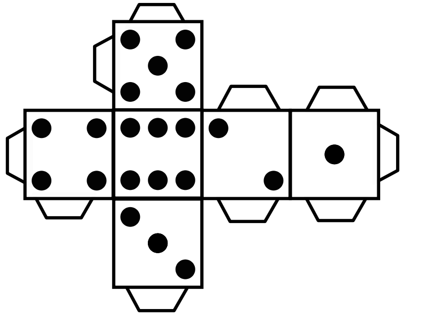

The end result should look similar to this:

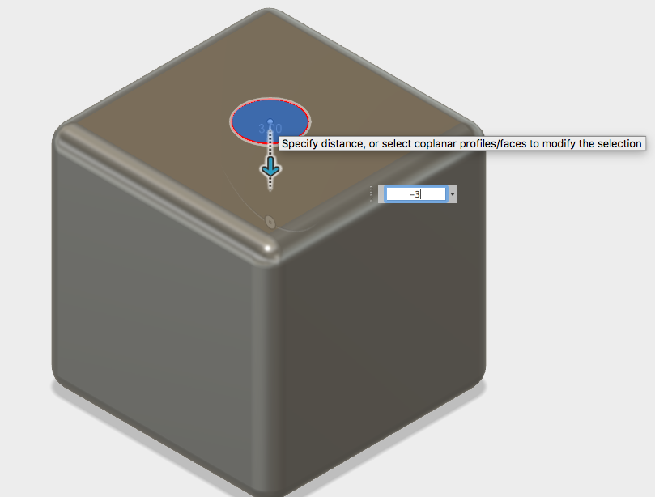

**TIP: When subtracting, multiple circles can be selected**
 
# Object Two – CUP
In this section of the tutorial, we will work on line construction, line fillet, and revolving 
## Creating a Base Sketch
Select the **SKETCH** option in the toolbar and click on the **LINE** tool.
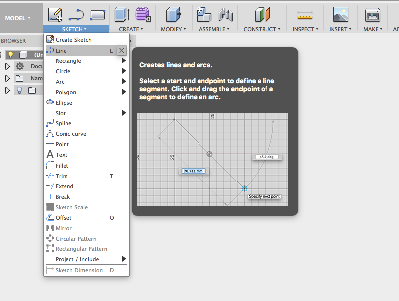

Select the plane of the workspace you would like to draw on. 
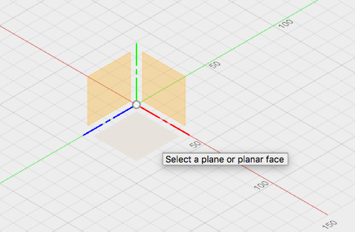

Click on the **ZERO POINT** to create a starting point for your line.
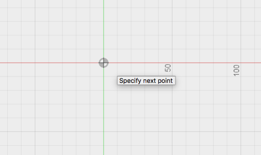

Input the value of 15mm with an angle of 90 degrees for your first line and then press enter- _To move between boxes click the **TAB** button_. 

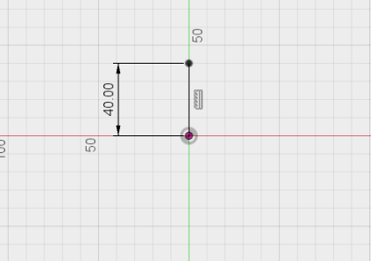

Select the **LINE** tool and click on the end point of your first line, creating a second line fragement with the values of 10mm and 90 degrees.

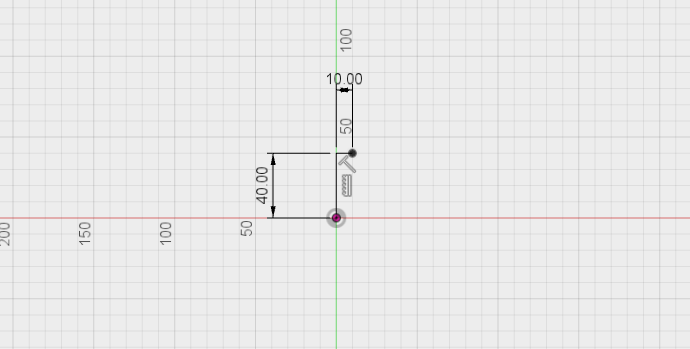

Again, select the **LINE** tool and click the end point of your latest line fragment, creating a new line with the values 30 mm and 90 degrees. 

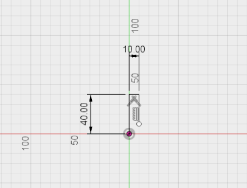

Once more, select the **LINE** tool again, clicking the end of your latest line and creating another line with the values of 50 mm and 45 degrees.

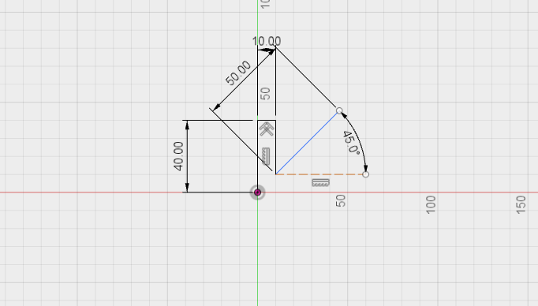

Continue in the same way you have been with the following lines:
**TIP: the LINE tool can be used to draw multiple lines at once**

* 90mm, 12 degrees
* 9mm, 90 degrees
* 89mm, 169 degrees

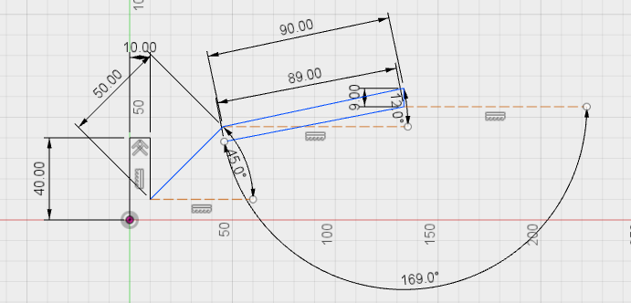

* 29mm, 125 degrees
* 17mm, 90 degrees 
* 17.919mm, 180 degrees

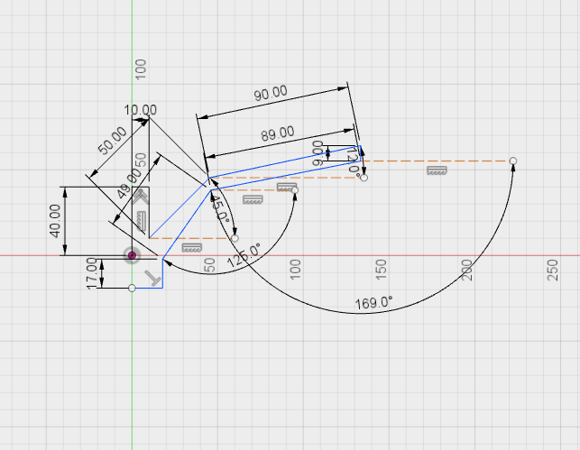

Enclose your base shape with a final line of 19.053mm and 90 degrees. 
Your completed shape should look (something) like this: 

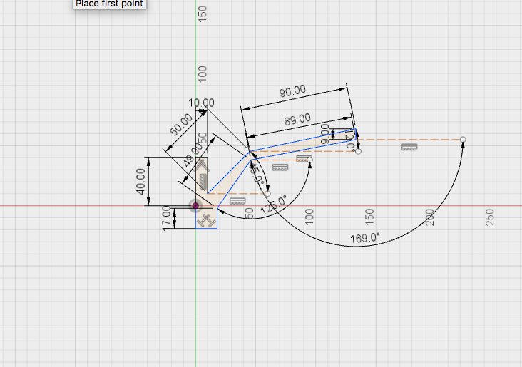
 
## Revolving

Now select the **CREATE** tab and select the **REVOLVE** tool. 
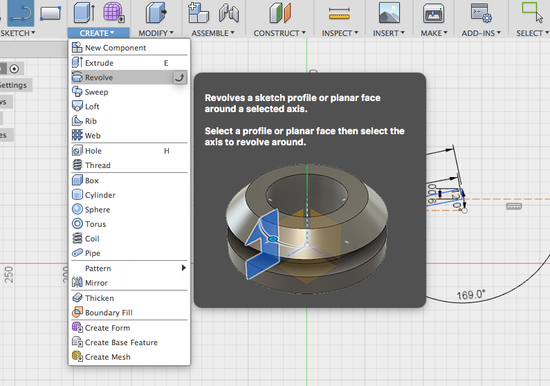

Click on your complete shape so that it’s highlited in blue- this is the _PROFILE_ of the revolve, the shape that will be extruded in a circle. 

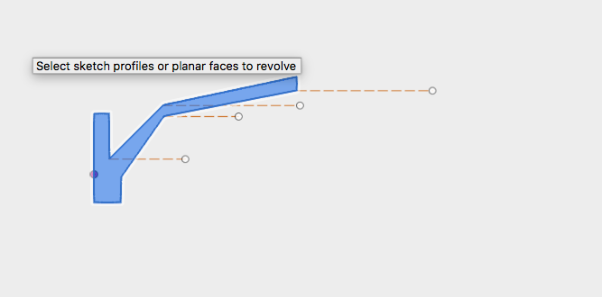

To the right of your workspace there is a tab that says **REVOLVE**. In that window, select as the _AXIS_ for the revolve (the line that will be the centre of your shape), click on the second last line you drew (17.919mm 180 degrees) and you will get a 3D shape that looks like this:

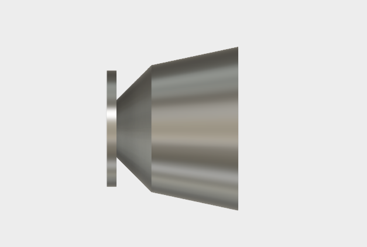

For another view of your cup, click on the home icon on the top right of your screen. 

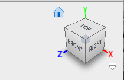

## Modifying the Cup
Next, we will smooth the edges of the cup. Under the **MODIFY** tab, select the **FILLET** tool.
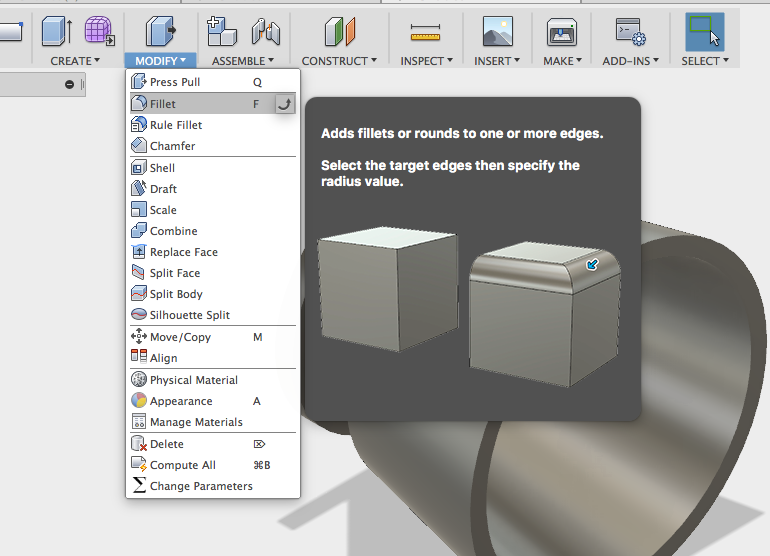

Select all the edges that you want to smooth, they will be highlighted in blue when selected. 
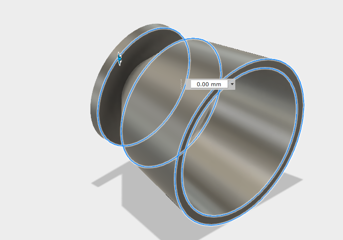

Enter a value of 2 into the radius tab that opens up and your final cup will look like this: 
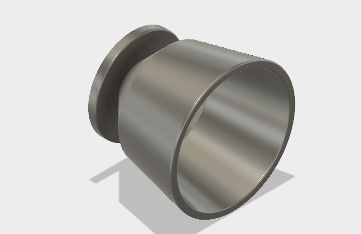

Now that you’ve made a basic cup you can try making vessels using different shapes and drawing tools, here are two examples:  

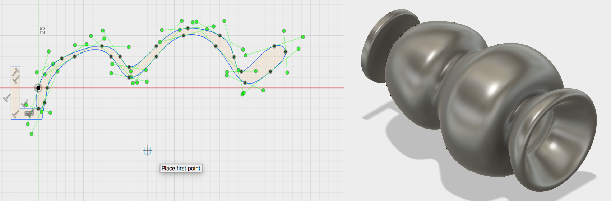
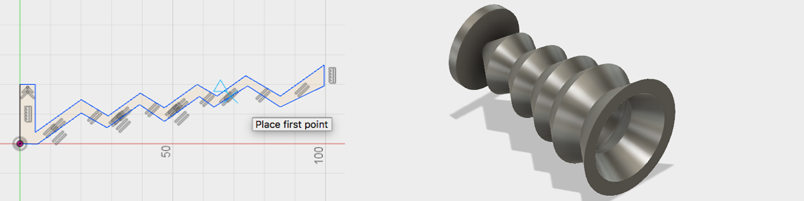

Trying experimenting with cups and opther similar objects, revolving can make a simple shape into an interesting object. If you want to print something like this, just make sure **the object is small (under 2.5cm in height)** and that **there are no overhangs or anglesover 45 degrees into open space**. 

# Object Three – Dish (Incomplete- but you can figure it out!!)
In this section of the tutorial the push and shell function will be taught
## Creating a Base Sketch
Select the **SKETCH** option in the toolbar and click on the **ELLIPSE** option. Then click on the grid in the workspace.
[comment]: Image 

Using the Zero Point as your starting point create an input a width of 10 mm and a length of 25 mm.
[comment]: Image 

Select the **CREATE** option from the toolbar and click on the **EXTRUDE** tool. Click on the Ellipse and input a value of 10mm. **DO NOT PRESS ENTER YET**
[comment]: Image 

Above the preview of the extrude there is a dial that can be moved. This is the push function. Begin to move the wheel and then input a value of 45 degrees and press enter.
[comment]: Image 

The end result should look like this:
[comment]: Image 

## Shelling
Select the **MODIFY** option in the toolbar and click on the SHELL tool.
[comment]: Image 

Click upon the top face of the object. Input a value of 2mm and press enter.
[comment]: Image 

The End result should look like this:
[comment]: Image 

# Finishing your 3D Models
Once you’ve finished your 3D model it needs to be exported as an **STL** if you want to 3D print it. To do this, select **FILE** > **3D PRINT** and in the dialogue box, make sure you select "high" refinement, and _uncheck_ "Send to 3D Print Utility". 
[comment]: Image 

Save your file and you’re ready to 3D print!

For the rest of the workshop you are free to design whatever you’d like-- let us know if you'd like to print!

